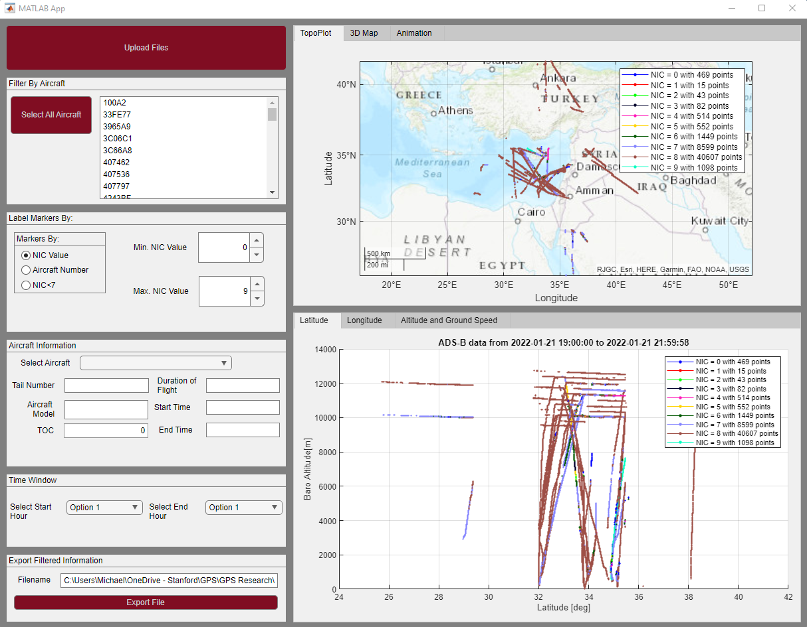

# ADSBPlot
Plots ADS-B Data into the MATLAB GUI Interface, `ADSB_Main_Plot`. Included figure types are:
  - Altitude vs. Latitude and Longitude, respectively: `plot_2D_LonAlt.m` and `plot_2D_LonAlt.m`
  - 2D Topographic Plot: `plottopo.m`
  - 3D Aerial Plot: `plot_3Dterrain.m`
  - Animation of Selected Data: `plot_flightanim.m`
  - Groundspeed and Altitude of Selected Aircraft: `plot_speed.m`

## Installation
### Dependencies:
This app requires `ADSBtools` package, created by Zixi Liu, and can be found at the [`ADSBtools`](https://github.com/liu1322/ADSBtools) Github Repository. Once the package is installed, make sure to add to your existing path using the MATLAB command, `addpath()`.

### Access Tokens:
In order to view the 3D terrain, an account must be created with the US Geological Survey Earth Explorer API, which can be found [here](https://earthexplorer.usgs.gov/). Once an account is created, the username and password can be entered into the Python script `GetBaseMapData` within the [ADSBtools](https://github.com/liu1322/ADSBtools/tree/interpolate_process/%2BADSBtools/%2Butil) directory.

## Operation:
To use GUI interface `ADSB_Main_Plot`, open `ADSB_Main_Plot.mlapp` in MATLAB click 'Run.' To upload ADS-B data, click `Upload Files` in the top left corner of the window. You can select one or multiple files before closing the window. The uploaded data must be either the raw Position ADS-B message, or a State Vector (SV) report (which contain at least {time,lat, lon, alt, and icao}). If the uploaded data does not contain NIC values, then it will default to the ICAO number, and will not allow the user to select NIC as the desired marker.

### Filtering Methods
#### Markers
Figures are color-coded based on user selection within the User Interface. The main marker choices are 1) Navigational Integrity Category (NIC) Value, 2) ICAO Number, or 3) NIC Value threshold that implies some form of interference. If the NIC value of an ADS-B message/position is below a value of 7 (possible intererence), the position fix will indicate with a red marker, otherwise, the position fix will be indicated with a green marker.

#### Min/Max NIC Value
ADS-B data is also filtered by determining the NIC value threshold viewable from the Figures. NIC values range from 0-11.

#### Time Window
To adjust the static time window of all the figures, simply go the tab subsection on the GUI interface `Time Window` and select the desired starting and closing hour on the ADS-B data. 

## Exporting Files
### Filtered Dataset
To save the filtered data created within the GUI interface, go to the `Export Filtered Information` tab. Edit the filename as desired, then click `Export File`. 

### Figures
To save any of the desired figures within the UI, go to the tab `Save Figures`, and select the desired figure to be saved. Then click `Export Figures`, and chose local directory location to be saved.

### Video
To create a video of the filtered data within the GUI interface, go to the `Animation` tab. From there, specify the filename of the video. The user also has the ability to specify framerate, file type and length of video in minutes. Click `Create Video to generate an animation of the flight paths that can be saved locally for viewing.
